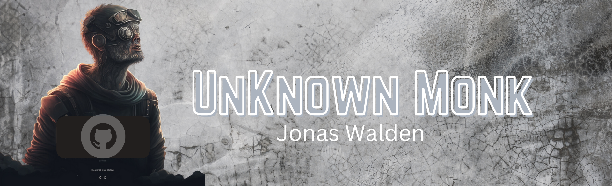

I am an a developer 5 years of experience as a full stack developer React/Next.js and Node are my chosen technologies to build with. 
I sepent my first 4 years building websites and developing my skills in HTML/Css and JavaScript before I attended a 9 month boot-camp for computer sicence and full stack web development and I have been working professonaly with small to mid sized companys ever since as they say the rest is history 

I am currently looking for new opportunities and I am open to work, Contract or Full time.

<h2>My skills</h2>
  

<h2>My GitHub Stats</h2>

  

